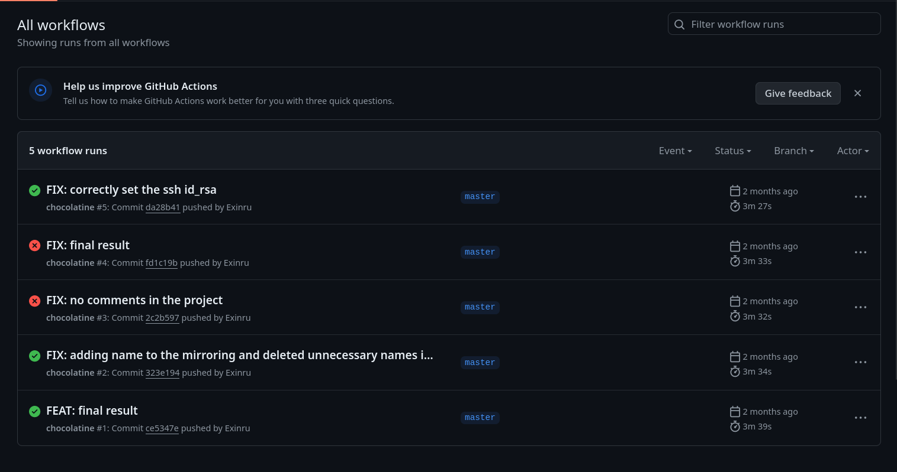
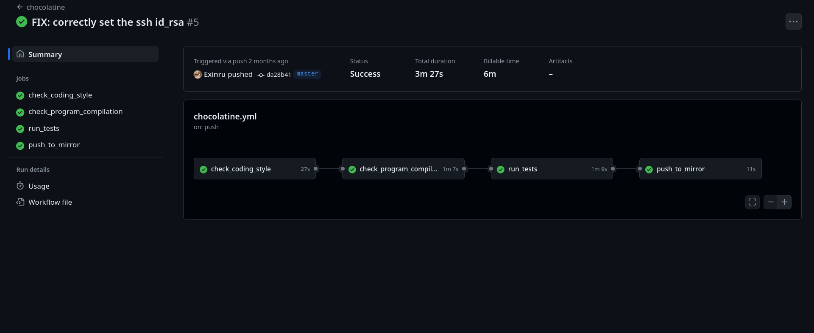
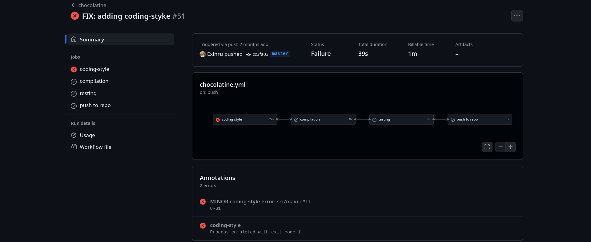

# Chocolatine
###### Module: Devops
## Objectives:
* Set up GitHub Actions
* Launch defined Actions
* Create annotations
* Assure the correct execution of the program

## Project images:
###### Github Actions:

###### Workflow:

###### Annotations:

